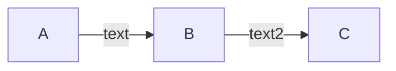

I used Chart.js charts on one of my Hugo blogs for few years already. Recently I needed to add few diagrams and I started glueing them in Chart.js but then I found that Hugo supports [GoAT and Mermaid diagrams](https://gohugo.io/content-management/diagrams/) . They’re not working out of the box, but it’s easy to extend. Much easier than my custom shortcodes.

I tried to follow up the instruction[1](#fn:1) but failed. After few minutes I found slightly simpler solution. Just create file: `layouts/_default/_markup/render-codeblock-mermaid.html` and fill it with:

layouts/_default/_markup/render-codeblock-mermaid.html

```
<pre class="mermaid">
  {{- .Inner | safeHTML }}
</pre>

{{- if not (.Page.Store.Get "hasMermaid") -}}
  {{- .Page.Store.Set "hasMermaid" true -}}
  {{- $theme := "neutral" -}}
  {{- if eq site.Params.defaultTheme "dark" -}}
    {{- $theme = "dark" -}}
  {{- end -}}
  <script type="module">
    import mermaid from 'https://cdn.jsdelivr.net/npm/mermaid/dist/mermaid.esm.min.mjs';
    mermaid.initialize({
      startOnLoad: true,
      theme: '{{ $theme }}'
    });
  </script>
{{- end -}}
```

The best thing about this code is that it will load Javascript only once per web page. The only thing to add Mermaid diagram to my pages I have to call it like:

````

````

Just past it in the Markdown file and you will get:

flowchart LR
   A -- text --> B -- text2 --> C

Nice and simple as ABC 😃